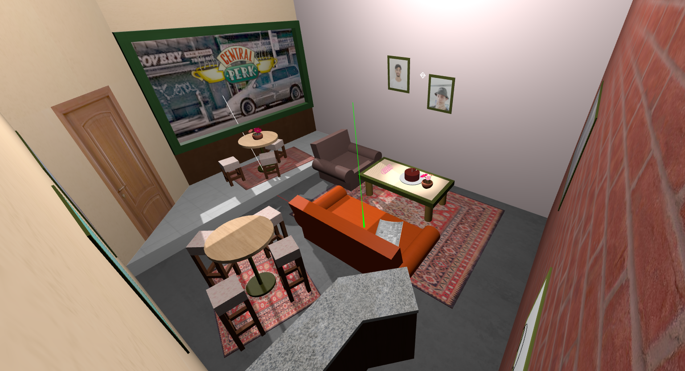
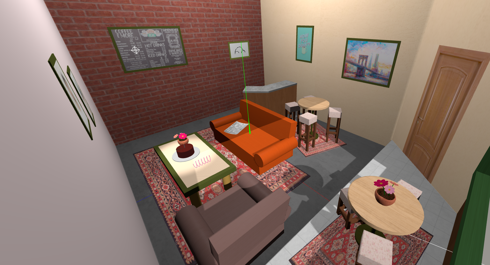
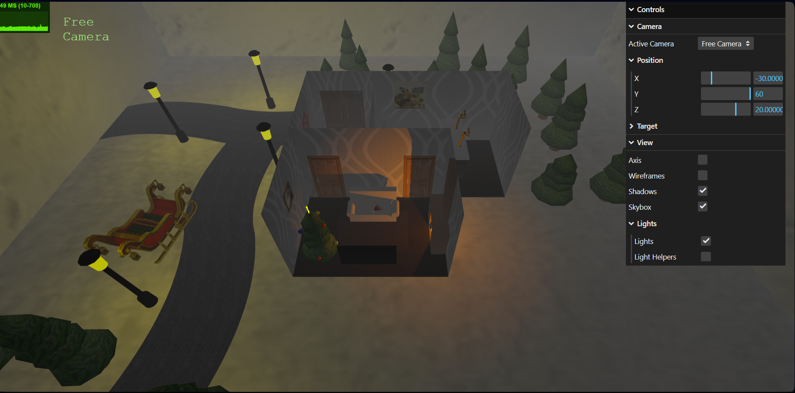
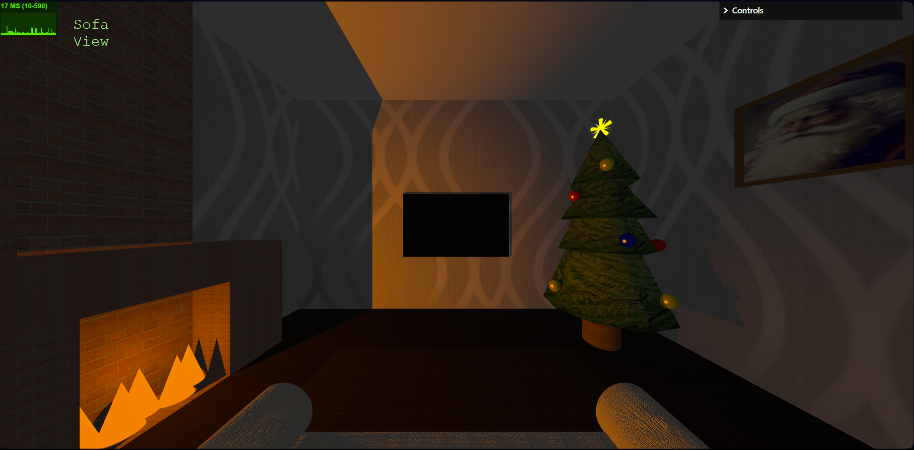

# SGI 2023/2024

## Group T0xG0y
| Name             | Number    | E-Mail             |
| ---------------- | --------- | ------------------ |
| John Doe         | 201901010 | ...                |
| Jane Doe         | 201901011 | ...                |

----

## Projects

### [TP1 - ThreeJS Basics](tp1)

This [scene](tp1/index.html) is based on the TV show [Friends](https://pt.wikipedia.org/wiki/Friends), more specifically the coffee shop [Central Perk](https://friends.fandom.com/wiki/Central_Perk).
It includes the infamous couches and table, as well as some background table and chair sets and a counter.

  
  

### [TP2 - ...](tp2)
This [scene](tp2/index.html) resembles Santa's remote house when he needs a rest from his big and busy night. Apart from the house includes a road, pine trees all around, lamps, as well as his sled.

  
  

### [TP3 - ...](tp3)
- (items briefly describing main strong points)

