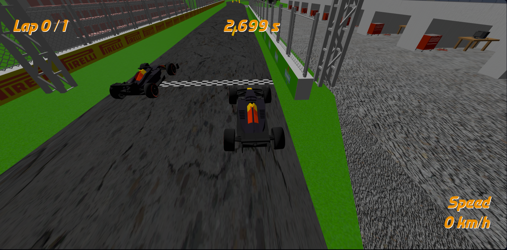
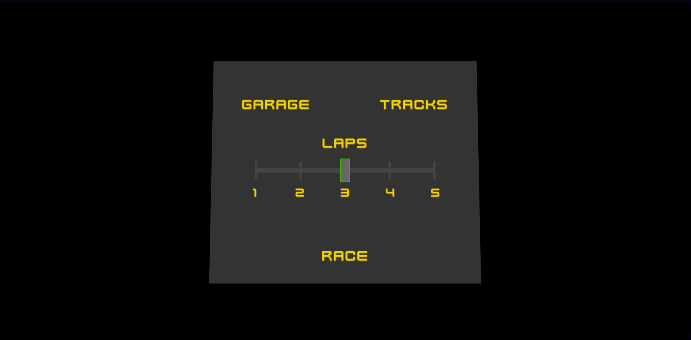
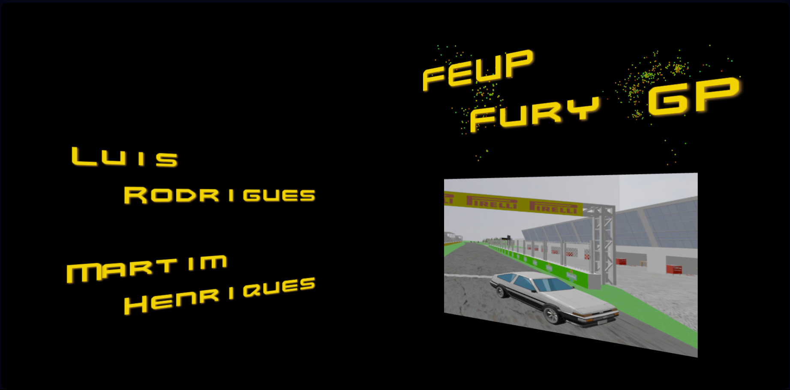

# Interactive Graphics Systems

This project is part of the Information Processing and Retrieval Curricular Unit @ FEUP.

It is comprised of three major tasks that explore the design of interactive systems using ThreeJS.

## Group T08G10

| Name                | Number    | E-Mail            |
| ------------------- | --------- | ----------------- |
| José Luís Rodrigues | 202008462 | up202008462@up.pt |
| Martim Henriques    | 202004421 | up202004421@up.pt |

----

## Projects

### [TP1 - Central Perk](tp1)

> You can play the scene [here](https://jlcrodrigues.github.io/feup-sgi/tp1/index.html)

This [scene](tp1/index.html) is based on the TV show [Friends](https://pt.wikipedia.org/wiki/Friends), more specifically the coffee shop [Central Perk](https://friends.fandom.com/wiki/Central_Perk).
It includes the infamous couches and table, as well as some background table and chair sets and a counter.

  
  

### [TP2 - Santa's Village](tp2)

> You can play the scene [here](https://jlcrodrigues.github.io/feup-sgi/tp2/index.html)

This [scene](tp2/index.html) resembles Santa's remote house when he needs a rest from his big and busy night. Apart from the house includes a road, pine trees all around, lamps, as well as his sled.

  
  

### [TP3 - FEUP Fury GP](tp3)

> You can play the game [here](https://jlcrodrigues.github.io/feup-sgi/tp3/index.html)

We present FEUP Fury GP, a fun and interactive game of a racing match between you and an AI Master Driver

  

A Race Menu and a presentation page

  

  

