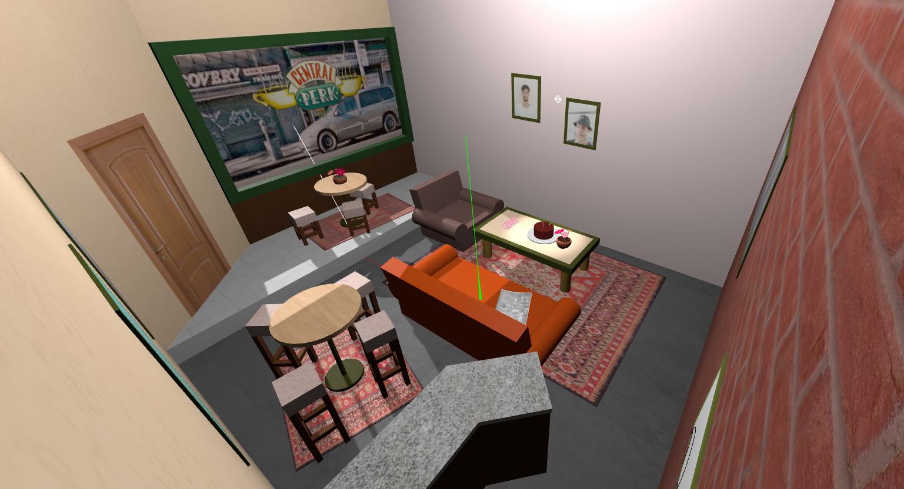
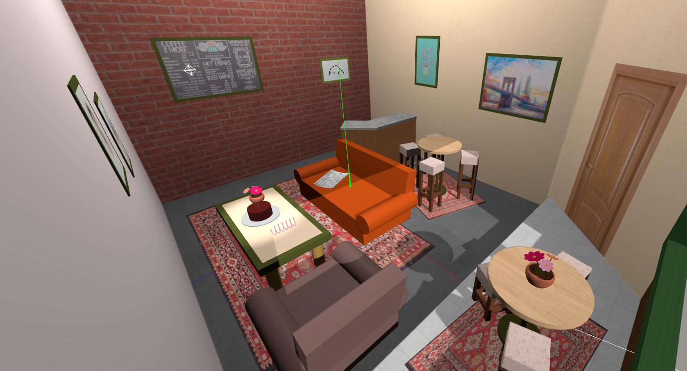
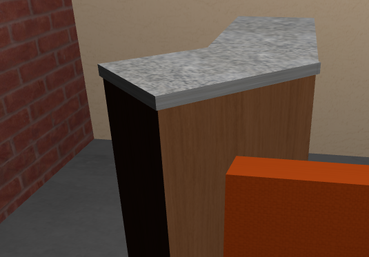

# SGI 2023/2024 - TP1

## Group: T08G10

| Name                | Number    | E-Mail            |
| ------------------- | --------- | ----------------- |
| José Luís Rodrigues | 202008462 | up202008462@up.pt |
| Martim Henriques    | 202004421  | up202004421@up.pt  |

---

## Project information

### Central Perk

This [scene](tp1/index.html) is based on the TV show [Friends](https://pt.wikipedia.org/wiki/Friends), more specifically the coffee shop [Central Perk](https://friends.fandom.com/wiki/Central_Perk).
It includes the infamous couches and table, as well as some background table and chair sets and a counter.

  
  

This section outlines the main features of the [scene](tp1/index.html).

- **Table section**

  - Includes the specified **table**, **cake** (including plate and candle) and **spring**. A **flower vase** can also be seen.
  

    
  

- **Textures** were used extensively throughout the scene, namely on the couches, table, cake, flower vase, counter, door, rug, floor, walls and more.

  - **Pictures** The scene includes several picture frames, including two with the students photos
    

      
      
    

  - **Window** The window was built to simulate the one from the show and includes a texture of the outside view
    

      
    

  - Some examples of the general use of textures are shown below
    

      
      
      
    

  - **Curves**
    - **Beetle**
      

        
      

    - **Spring**
      

        
      

    - **Flowers**
      

        
      

  - **Lights and Shadows** The scene defines three lights: A Spotlight focused on the cake, a Directional light focused on the window and a Point light on the ceiling.
  The scene includes a shadow map for the cake's spot light and another for the directional light. 
    

      
    

## Issues/Problems

#### Suggested Improvements

Some objects that were not included in the scene but could be added in the future are:
 - Guitar
 - Coffee Mug
 - Beer tap