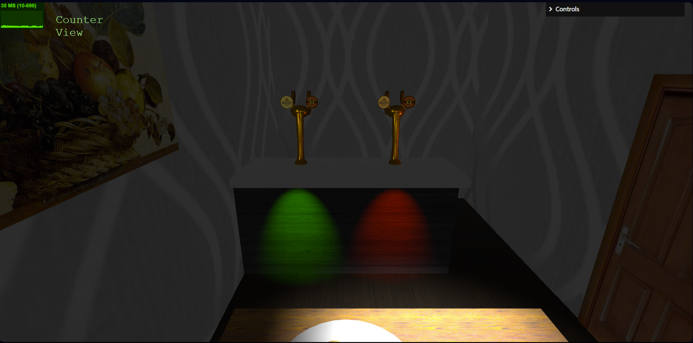

# SGI 2023/2024 - TP2

## Group: T08G10

| Name             | Number    | E-Mail             |
| ---------------- | --------- | ------------------ |
| José Luís Rodrigues | 202008462 | up202008462@up.pt |
| Martim Henriques    | 202004421  | up202004421@up.pt  |

----
## Project information

### Santa's Home

This [scene](tp2/index.html) resembles Santa's remote house when he needs a rest from his big and busy night. It includes a road, pine trees all around, lamps, as well as his sled.

- Scene

  

The house has 3 main divisions: 
  - hall (presents, Santa's bag and 2 polygons);
  - living room (sofa, rug, christmas tree, TV, Santa's picture and a fireplace);
  - kitchen (table, plate, cookies, counter and 2 beer taps);

Living room seen from the sofa:

  

And as a surprise, Santa prefers beer to milk with cookies, that's why he built this kitchen counter with the beer taps:

  

----
## Issues/Problems

- some lights escape between the objects
